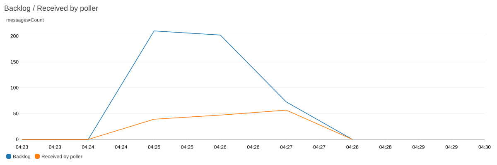
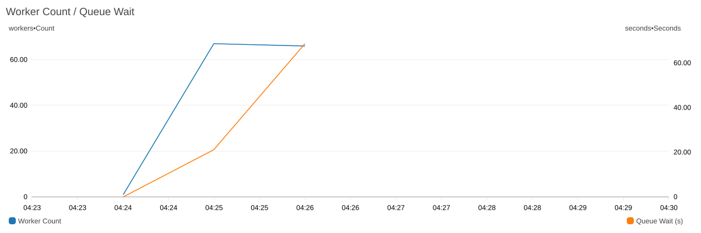
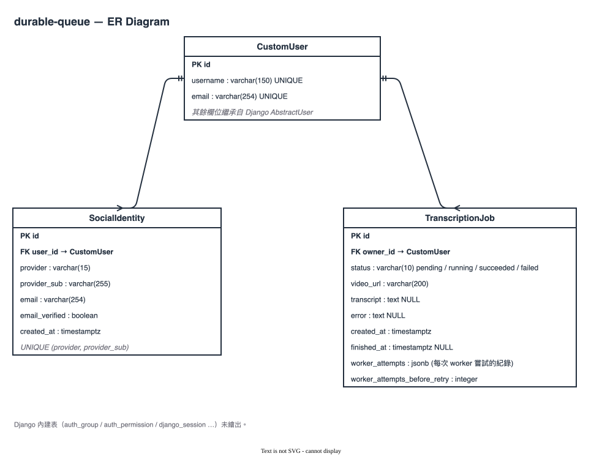

# durable-queue

[](https://github.com/loijilai/durable-queue/actions/workflows/ci-cd.yml)
[](https://app.loijilai.site)

A distributed system built to answer one question : **how to make sure a job that was accepted actually gets done, even when the process running it dies halfway through?**

---

## Table of Contents

- [durable-queue](#durable-queue)
  - [Table of Contents](#table-of-contents)
  - [Requirements](#requirements)
  - [Architecture](#architecture)
  - [Schema](#schema)
  - [Deep dives](#deep-dives)
  - [Deployment pipeline](#deployment-pipeline)
  - [Verification](#verification)
  - [Tech stack](#tech-stack)
  - [Running locally](#running-locally)

---

## Requirements

**Functional**

1. User submits a YouTube URL and immediately gets back a job ID — the request does not wait for transcription to finish.
2. User can query job status: `PENDING → RUNNING → SUCCEEDED / FAILED`.
3. Failed jobs can retry, both automatically and on manual trigger.
4. A user can only see their own jobs (multi-tenant isolation).
5. User can authenticate with a local username/password or Google OAuth.

**Non-functional**

- **Durability** — a worker crash must not lose a job; state survives in the database, not in process memory.
- **Scalability** — the promise is made on **Queue Wait**: the time between a job being accepted and a worker picking it up. It deliberately excludes execution time, which is set by the length of the video and which no capacity decision can move.
- **Availability** — the system keeps serving through individual API task or worker invocation failures, and through deploys.
- **Security** — secrets, network paths, and user data are isolated at the appropriate boundaries.

## Architecture


The API runs on ECS/Fargate behind an ALB. Accepted jobs go onto an SQS queue, and each message triggers one AWS Lambda invocation of the worker (event source mapping, batch size 1). Lambda adds workers as the Backlog grows, up to a **Scaling Ceiling of 67** — the RDS connection budget left for workers. Jobs beyond the ceiling wait on the queue instead of being throttled.

A burst of 250 jobs (24 s each): Worker Count reaches the ceiling of 67 and the rest wait in the Backlog. All 250 succeeded on their first attempt, with zero throttles and an empty DLQ.





## Schema



`SocialIdentity` maps an external identity provider account — `(provider, provider_sub)`, where `provider_sub` is the permanent user id that provider issues — to a local `CustomUser`. It is a separate table rather than columns on `CustomUser` for three reasons:

- **One user can hold several identities.** Adding GitHub alongside Google is another row.
- **The provider's email is not the local email.** A user can change their local address while Google still reports the old one; storing them separately keeps one from overwriting the other.
- **The uniqueness constraint belongs on the pair.** `UniqueConstraint(["provider", "provider_sub"])` stops one provider account from binding to two local users. It has to be composite — ids from different providers can collide.

## Deep dives

1. **[Durability](https://app.loijilai.site/durability)**
2. **[Concurrency](https://app.loijilai.site/durability)** — at-least-once delivery means two workers can legitimately hold the same job at once.
3. **[Scalability](https://app.loijilai.site/scalability)** — Lambda scales with the **Backlog** up to a Scaling Ceiling set by the database, not by compute.
4. **[Security](https://app.loijilai.site/security)**

## Deployment pipeline

`git push` → one Docker image is built and pushed, tagged by commit SHA → Terraform applies the declared infrastructure → **database migrations run as a single one-off ECS task** → the API service rolls onto the new task definition and the worker Lambda function onto the new image, and the deploy waits for each to become stable.

Defined in [`.github/workflows/ci-cd.yml`](.github/workflows/ci-cd.yml); infrastructure lives in [`infra/`](infra).

## Verification

The repository has one verification interface for local agents and CI:

```bash
./scripts/verify.sh quick  # no database or running Docker daemon required
./scripts/verify.sh full   # isolated PostgreSQL, all tests, builds, and Terraform validation
```

The first run creates `.venv` and installs the locked frontend dependencies.
Later runs reuse them until `requirements.txt` or `package-lock.json` changes.
Python 3.13, Node.js 22, Terraform 1.5+, Docker, and Docker Compose must be
installed; the Docker daemon only needs to be running for `full`.

## Tech stack

| Layer                  | Technology                                                                          |
| ---------------------- | ----------------------------------------------------------------------------------- |
| API                    | Python 3.13, Django 6, Django REST Framework                                        |
| Job queue and worker   | Amazon SQS triggering AWS Lambda (ElasticMQ and a polling shim locally)             |
| Database               | PostgreSQL (RDS in prod)                                                            |
| Frontend               | React, TypeScript, Vite                                                             |
| Observability          | CloudWatch dashboard, JSON structured logs, log metric filters                      |
| Infrastructure as Code | Terraform (S3 remote state)                                                         |
| Cloud                  | AWS — ALB, ECS/Fargate, Lambda, SQS, RDS, CloudWatch, Secrets Manager, Route 53/ACM |
| CI/CD                  | GitHub Actions, OIDC-based AWS auth                                                 |

## Running locally

Backend (API + worker + Postgres + ElasticMQ via Docker Compose):

```bash
cd durable_queue
docker compose up --build
```

Frontend:

```bash
cd frontend
npm install
npm run dev
```
