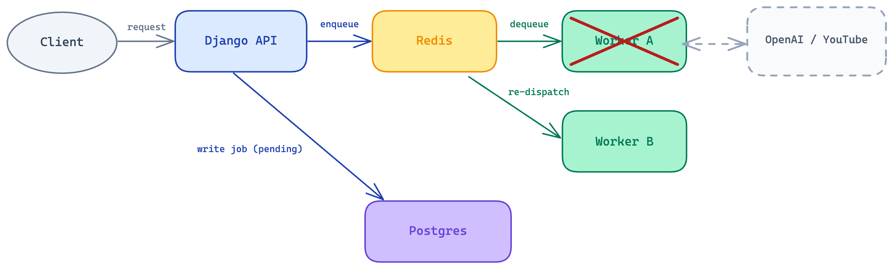
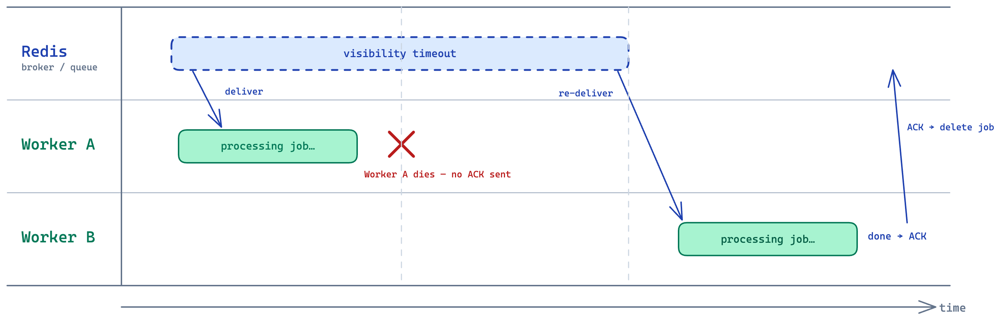
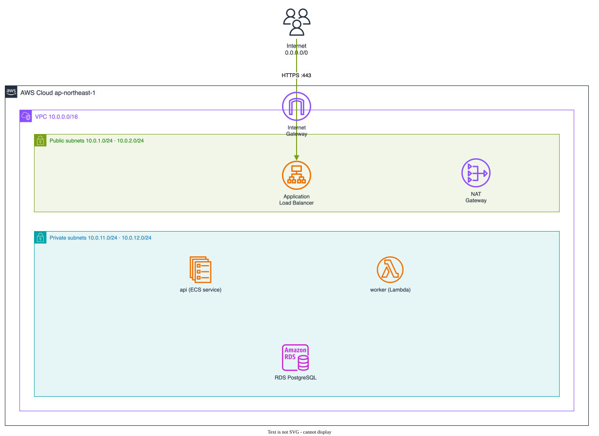
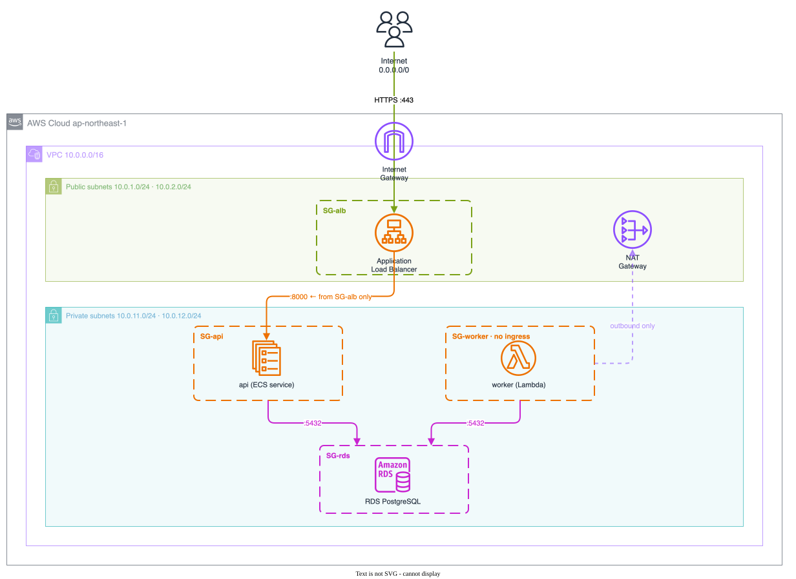
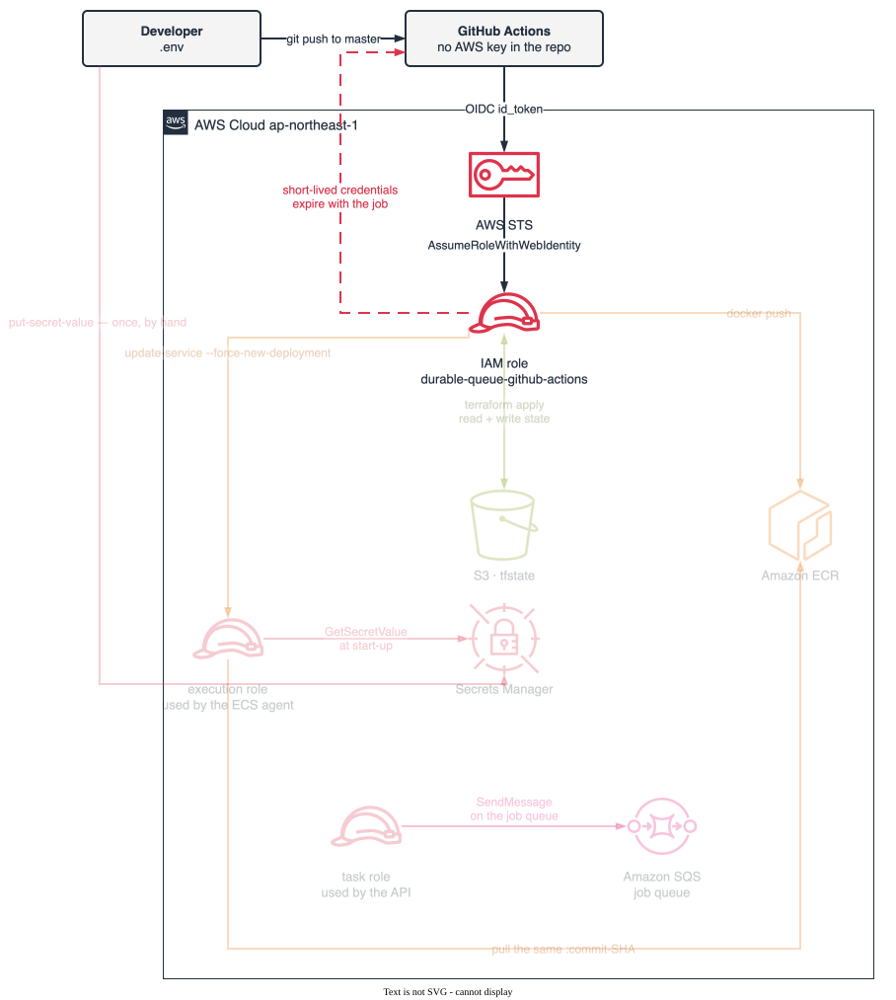
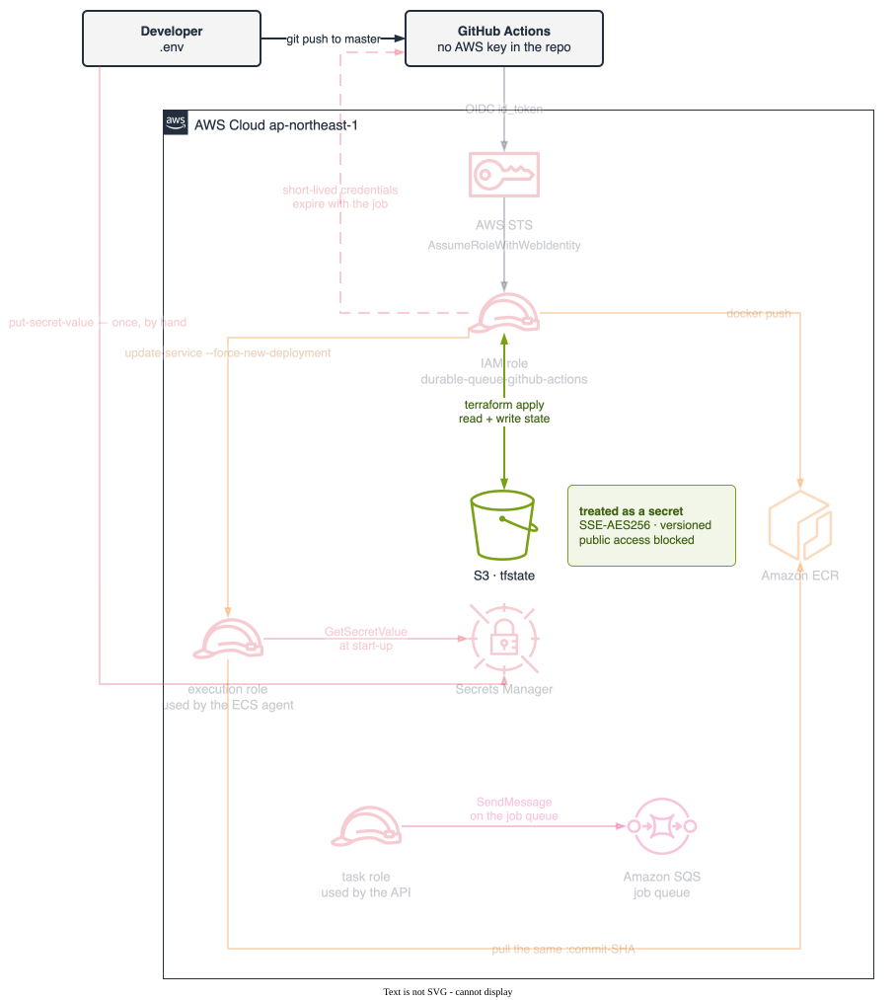

# durable-queue

[](https://github.com/loijilai/durable-queue/actions/workflows/ci-cd.yml)
[](https://durable-queue.loijilai.site)

A distributed system built to answer one question : **how to make sure a job that was accepted actually gets done, even when the process running it dies halfway through?**

---

## Table of Contents

- [durable-queue](#durable-queue)
  - [Table of Contents](#table-of-contents)
  - [Requirements](#requirements)
  - [Architecture](#architecture)
  - [Deep dives](#deep-dives)
    - [1. Durability: a dead worker doesn't lose the job](#1-durability-a-dead-worker-doesnt-lose-the-job)
    - [2. Concurrency: what the lock actually protects](#2-concurrency-what-the-lock-actually-protects)
    - [3. Scalability: two independent scaling axes](#3-scalability-two-independent-scaling-axes)
    - [4. Security: authorization vs. reachability](#4-security-authorization-vs-reachability)
  - [Deployment pipeline](#deployment-pipeline)
  - [Tech stack](#tech-stack)
  - [Running locally](#running-locally)

---

## Requirements

**Functional**

1. User submits a YouTube URL and immediately gets back a job ID — the request does not wait for transcription to finish.
2. User can query job status: `PENDING → RUNNING → SUCCEEDED / FAILED`.
3. Failed jobs can retry, both automatically and on manual trigger.
4. A user can only see their own jobs (multi-tenant isolation).
5. User can authenticate with a local username/password or Google OAuth.

**Non-functional**

- **Durability** — a worker crash must not lose a job; state survives in the database, not in process memory.
- **Scalability** — the API tier and the worker tier scale independently, on different signals (HTTP concurrency vs. queue depth).
- **Availability** — the system keeps serving through individual API or worker instance failures.
- **Security** — secrets, network paths, and user data are isolated at the appropriate boundaries.

## Architecture


- **Route53 + ACM** terminate TLS on a public **ALB**, which fronts two independently-scaling **EC2 Auto Scaling Groups** in private subnets.
- **RDS Postgres** is the durable source of truth for job state. **ElastiCache Redis** is only the Celery broker + result backend.
- NAT + IGW give the private subnets controlled outbound access (pulling images, calling OpenAI) without allowing anything in from the internet.

## Deep dives

### 1. Durability: a dead worker doesn't lose the job

An unacked job doesn't vanish with its worker — Redis re-delivers it to another worker once the visibility timeout expires.

| Normal dispatch → crash → re-dispatch                                                          | Visibility-timeout mechanics                                                                                       |
| ---------------------------------------------------------------------------------------------- | ------------------------------------------------------------------------------------------------------------------ |
|  |  |

### 2. Concurrency: what the lock actually protects

Redis alone only guarantees _delivery_, not _exclusivity_ — after a re-deliver, two workers can legitimately hold the same job at once and race to write its final status.

| The race                                                                                                                  | `SELECT ... FOR UPDATE` closes it                                                                                                           |
| ------------------------------------------------------------------------------------------------------------------------- | ------------------------------------------------------------------------------------------------------------------------------------------- |
|  |  |

### 3. Scalability: two independent scaling axes

The queue decouples the API tier from the worker pool, so each scales on its own signal — HTTP concurrency for the API, queue depth for workers — which only works because the API is stateless (JWT, not session cookies).


### 4. Security: authorization vs. reachability

"Is this connection allowed" (Security Groups) and "is there a path to get there" (route tables) are answered by two separate mechanisms, never one.

| Network reachability                                                                                        | Security-group authorization chain                                                                          |
| ----------------------------------------------------------------------------------------------------------- | ----------------------------------------------------------------------------------------------------------- |
|  |  |

CI/CD identity and secrets follow the same discipline — no long-lived credentials, no plaintext at rest:

| GitHub OIDC → short-lived AWS credentials                                                                                    | Bootstrap vs. app-infra state split                                                                                         |
| ---------------------------------------------------------------------------------------------------------------------------- | --------------------------------------------------------------------------------------------------------------------------- |
|  |  |

Auth itself (JWT + Google OAuth from the [Requirements](#requirements)) follows the standard OIDC authorization-code flow — front-channel redirect to Google, back-channel code-for-token exchange, then the app mints its own short-lived JWT:


## Deployment pipeline

`git push` → Django tests run against a real Postgres service container → a single Docker image is built and pushed, tagged by commit SHA → Terraform applies the declared infrastructure → an EC2 **instance refresh** replaces the API fleet while keeping at least half of target capacity healthy throughout, so deploys are zero-downtime by construction rather than by luck.

Defined in [`.github/workflows/ci-cd.yml`](.github/workflows/ci-cd.yml); infrastructure lives in [`infra/`](infra).

## Tech stack

| Layer                  | Technology                                                                         |
| ---------------------- | ---------------------------------------------------------------------------------- |
| API                    | Python 3.13, Django 6, Django REST Framework                                       |
| Async task queue       | Celery + Redis (broker & result backend)                                           |
| Database               | PostgreSQL (RDS in prod)                                                           |
| Frontend               | React, TypeScript, Vite                                                            |
| Infrastructure as Code | Terraform (S3 remote state)                                                        |
| Cloud                  | AWS — ALB, EC2 Auto Scaling Groups, RDS, ElastiCache, Secrets Manager, Route53/ACM |
| CI/CD                  | GitHub Actions, OIDC-based AWS auth                                                |

## Running locally

Backend (API + worker + Postgres + Redis via Docker Compose):

```bash
cd durable_queue
docker compose up --build
```

Frontend:

```bash
cd frontend
npm install
npm run dev
```
