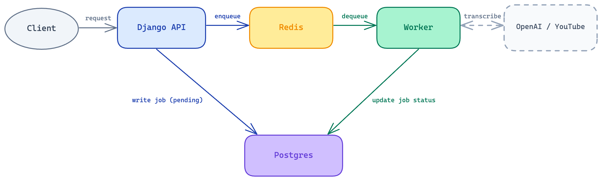
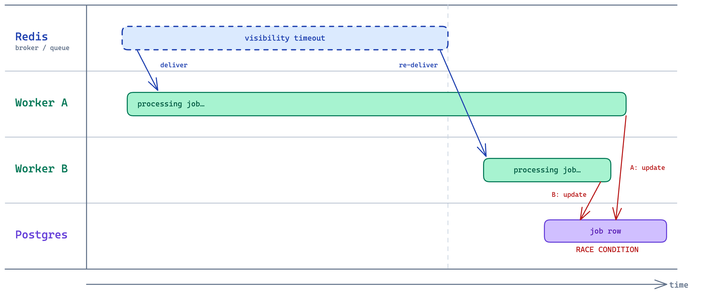
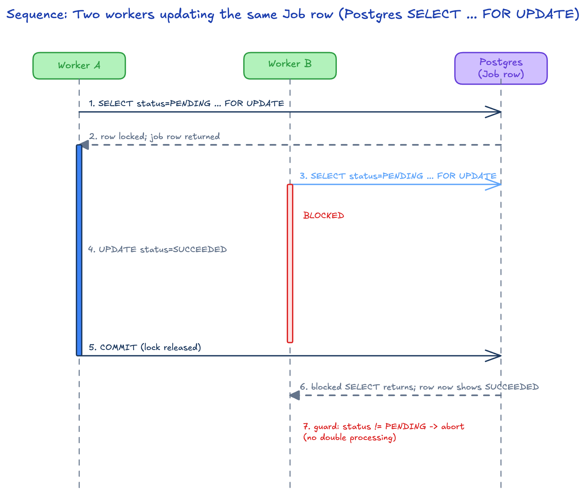
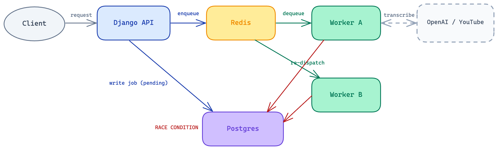
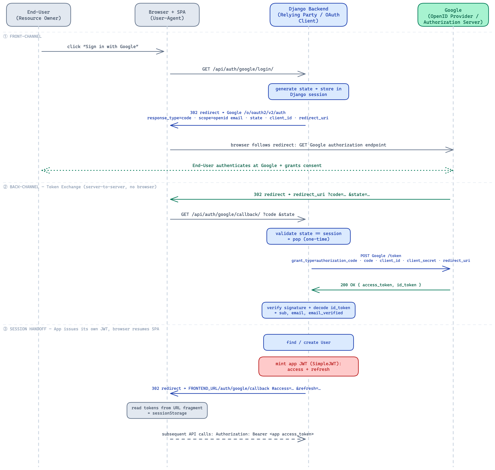
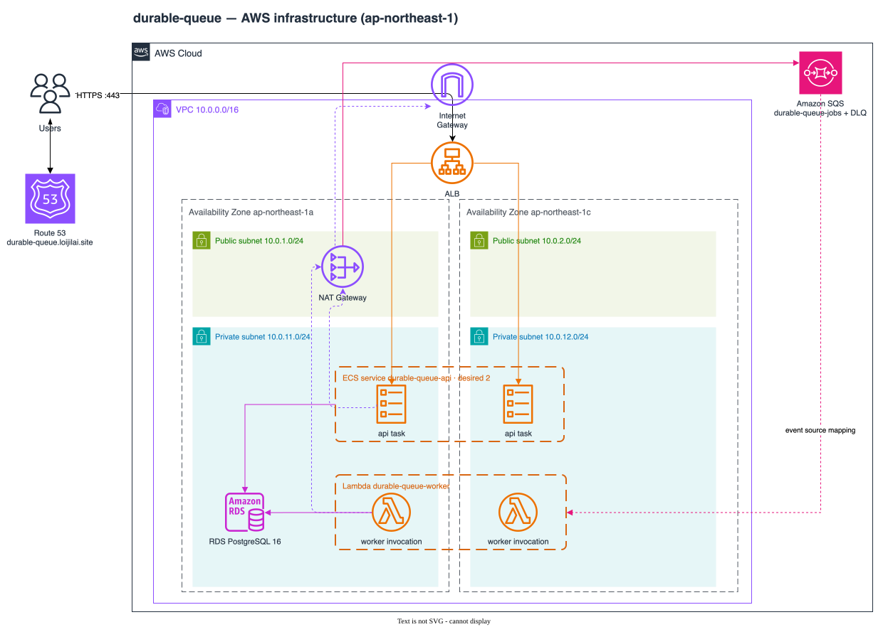
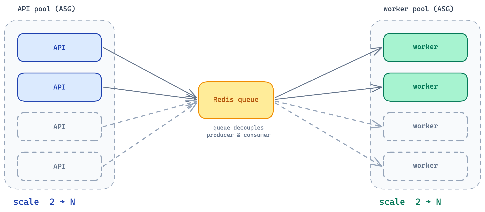

# Durable Queue architecture and current state

Status: current repository architecture. Future work is explicitly labeled and
lives under [`product-specs/`](product-specs/).

Last verified from the repository: 2026-08-12.

## Problem and guarantees

A client submits a YouTube URL and receives a job ID without waiting for the
long-running transcription. The system separates HTTP request handling from work
execution so accepted job state survives API and worker process failure.

Current guarantees:

- Job state is durable in PostgreSQL and exposed through the API.
- Celery/Redis delivery is at least once; duplicate delivery is expected.
- State transitions are serialized and terminal states are idempotent.
- A user can only query or retry their own jobs.

Not guaranteed today:

- Exactly-once execution of the external side effect.
- Durable broker storage through loss of the single Redis node.
- Multi-AZ availability for RDS, Redis, or NAT egress.

## Runtime components

| Component | Repository location | Responsibility |
| --- | --- | --- |
| Django API | `durable_queue/jobs/views.py`, `serializers.py` | Authenticate, validate input, expose owner-scoped jobs, dispatch tasks |
| Job services | `durable_queue/jobs/services.py` | Own transactional job-state transitions |
| Celery task | `durable_queue/jobs/tasks.py` | Coordinate delivery attempt, transcription, retry, and terminal result |
| Transcriber boundary | `durable_queue/jobs/transcribers.py` | Select fake or real transcription adapter |
| PostgreSQL | `TranscriptionJob` model | Authoritative job status, result, error, ownership, and attempts |
| Redis | Celery configuration | Broker and result backend; never authoritative job state |
| React SPA | `frontend/src/` | Authentication and interactive system-design demo |
| AWS infrastructure | `infra/` | Network, compute, stateful services, TLS/DNS, IAM, and deployment inputs |

The current backend has 36 Django tests covering API, authorization, OAuth,
serializer, service, task, and PostgreSQL row-lock concurrency behavior. The
frontend contains the delivered authentication, queue, durability, HA,
scalability, and security demo surfaces.

## Verification and enforced boundaries

`./scripts/verify.sh` is the repository's verification contract. `quick` runs
all database-independent checks and is the default agent feedback loop. `full`
adds an isolated PostgreSQL service, Django tests and migration drift detection,
frontend and backend production builds, and validation of all three Terraform
roots. Dependency manifests are hash-stamped so a clean checkout bootstraps
itself while unchanged dependencies are reused.

The quick loop mechanically enforces these current invariants:

- Job lifecycle fields are mutated only by transactional operations in
  `jobs/services.py`.
- Models do not depend on higher job layers; services depend only on models;
  tasks use services and the transcriber boundary rather than models directly.
- Markdown links, product-spec indexing, execution-plan status/location, and
  declared diagram assets remain internally consistent.
- Application configuration, `.env.example`, and deployment inputs stay aligned.

Non-trivial execution plans use two human gates. A new plan remains
`awaiting-approval` until implementation is explicitly approved; after full
verification it becomes `awaiting-final-review` and remains under `active/`
until explicit final approval permits archival as `completed`.

Checker failures include the violated invariant, source location, remediation,
and the command to rerun. Tests and migrations are deliberately outside the
production architecture scan.

## Request and job data flow

1. An authenticated client calls `POST /api/jobs/` with a YouTube URL.
2. Django writes a `PENDING` job owned by the caller, dispatches
   `execute_job.delay(job_id)`, and returns the job representation.
3. A Celery worker receives the delivery and calls `mark_running()` inside a
   database transaction. The worker identity is appended to `worker_attempts`.
4. The configured transcriber runs. The fake adapter is the current implemented
   path; the real adapter raises `NotImplementedError`.
5. The task writes `SUCCEEDED` plus transcript or, after exhausted retry/failure,
   `FAILED` plus error through the service boundary.
6. The SPA polls the owner-scoped API until it observes a terminal database state.

## State and concurrency boundaries

`TranscriptionJob` has four states: `PENDING`, `RUNNING`, `SUCCEEDED`, and
`FAILED`. Service functions use `transaction.atomic()` and
`select_for_update()` before checking and changing state.

The lock protects the read in check-then-act: a concurrent actor must observe the
committed status before deciding whether its transition is valid. A write lock by
itself would serialize updates but could still allow a decision based on stale data.

At-least-once delivery leaves an execution-layer window: an external side effect
can complete before the database result is committed. This is accepted for the
fake adapter and must be revisited by the real-transcription product spec.

## Authentication boundary

- Django issues JWT access and refresh tokens for local login and after Google
  OAuth identity verification.
- DRF defaults to `IsAuthenticated`.
- Job querysets are filtered by `request.user`; a job owned by someone else is
  returned as 404 rather than disclosing its existence.
- The SPA sends the access token in the `Authorization` header. Tokens are not
  cookie-based in the current demo. Access and refresh tokens live in
  `sessionStorage`, so same-origin JavaScript can read them if an XSS bug exists.

## Deployment topology

The deployed design uses one container image for two stateless roles: an API ASG
behind an ALB and a worker ASG consuming Redis deliveries. Both span two subnets/AZs
and scale independently. RDS PostgreSQL and ElastiCache Redis provide shared state.

Network/security boundaries:

- Internet traffic terminates TLS at the public ALB.
- API and worker instances live in private subnets.
- Security groups reference other security groups along ALB → compute → stateful
  service paths; route tables independently provide reachability.
- Private egress goes through one NAT gateway. Internet hosts cannot initiate a
  connection through that NAT.
- Runtime secrets are fetched from Secrets Manager by an instance role. GitHub
  Actions receives short-lived AWS credentials through OIDC.
- DNS/bootstrap resources have separate Terraform state because their lifecycle
  must outlive routine application infrastructure replacement.

## Availability and scaling status

The API and worker compute tiers are replaceable and distributed across two AZs.
The API ASG uses ALB health rather than VM existence alone. This does not make the
whole system highly available: RDS is single-AZ, Redis is single-node, and all
private egress shares one NAT gateway.

The queue decouples API and worker scaling signals, but linear worker scaling is
bounded by PostgreSQL, Redis, and the future external transcription API.

## Known implementation gaps

- `real_transcribe()` is not implemented; normal execution still uses the fake
  adapter. External timeout, rate limit, cost, media handling, and execution-layer
  idempotency remain unresolved.
- Redis is single-node, RDS has `multi_az = false`, and egress uses one NAT. The
  complete system does not provide stateful-tier or egress HA.
- API and worker startup both run migrations, which can race during rollout.
- Production structured logging, metrics, tracing, SLOs, and alerts do not exist;
  Flower provides development-time Celery visibility only.
- Worker scaling has no measured capacity envelope or backpressure policy for
  PostgreSQL, Redis, or the future external transcription API.
- The frontend build succeeds with a large-chunk warning. Lint has a zero-warning
  policy; the bundle warning remains a separate performance concern.

## Planned changes

Planned work is intentionally not described as current architecture. See:

- [Real transcription](product-specs/real-transcription.md)
- [Kubernetes and SQS](product-specs/kubernetes-sqs.md)
- [Production observability](product-specs/production-observability.md)
